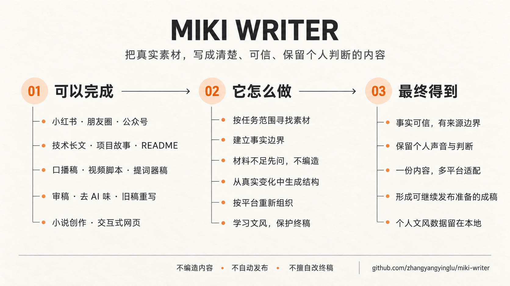

<a name="top"></a>
<div align="center">

# Miki Writer

**把一个已经想清楚的选题，直接变成能发出去的稿子。**
小红书 · 朋友圈 · 公众号 · 口播稿/视频脚本 · GitHub README · 小说 · 交互式网页——一条流程走完。

[](LICENSE)
[](SKILL.md)
[](#-必须配合-obsidian-使用)



</div>

这是一套给 AI 写作工具用的 **Skill**——一份指令文件，不是独立软件或 App。把它接入 Claude、Claude Code、Codex 这类能读写本地文件的 AI 工具后，AI 会按这里定义的规则，把你真实的项目、经历和观点写成不同格式的稿子：动笔前先自己找素材，写完主动要反馈，反复修改的过程本身就是它学你文风的过程，不用每次重新跟 AI 解释"我的风格是什么"。

**入口文件是 `SKILL.md`**：它先判断你要写哪种东西，再去读对应的 `references/` 文件拿具体规则。`references/` 里的文件都不是独立使用的，是 `SKILL.md` 按任务模式按需调用的细节说明。

### 目录

[🧭 支持的任务模式](#-支持的任务模式) · [🛠️ 核心能力](#️-核心能力) · [📓 必须配合 Obsidian 使用](#-必须配合-obsidian-使用) · [🚀 快速开始](#-快速开始) · [🚫 它不会做的事](#-它不会做的事) · [🔒 隐私与可移植性](#-关于隐私和可移植性) · [📜 许可证](#-许可证) · [📁 文件结构](#-文件结构)

---

## 🧭 支持的任务模式

| 模式 | 用来做什么 | 对应规则文件 |
| --- | --- | --- |
| 小红书 / 抖音图文 | 控制字数、话题标签建议、合规自查、配图建议 | `format-specs.md` |
| 朋友圈 / 社交动态 | 私域场景的短文案，语气更随意 | `format-specs.md` |
| 公众号长文 / 技术长文 | 事实核验 + 六步技术写法，可一键改写适配多平台 | `facts-and-writing.md`、`format-specs.md` |
| 口播稿 / 视频脚本 / 提词器稿 | 台词、画面、节奏对照表 | `format-specs.md` |
| GitHub README | 生成或优化项目 README（默认只出中文，其他语言按要求） | `format-specs.md` |
| 审稿 / 去 AI 味 | 按你的措辞判断只提建议，还是直接改稿 | `de-ai-calibration.md` |
| 重写旧稿 | 保留可验证事实，指出失速点后重组，不是同义改写 | `facts-and-writing.md` |
| 小说（虚构创作） | 唯一不受事实边界约束的模式，情节人物可以虚构 | `fiction-writing.md` |
| 交互式网页（HTML） | 单文件、真交互（点击展开/tab/图表）的网页 | `interactive-html.md` |

以上所有模式都共用两份文件：`facts-and-writing.md`（事实边界方法，虚构类的小说模式除外）和 `author-voice.md`（文风记忆，持续从你的手改稿里学习）。

<div align="right"><a href="#top">⬆ 回到顶部</a></div>

---

## 🛠️ 核心能力

| 能力 | 说明 |
| --- | --- |
| 主动检索素材 | 动笔前先去 Obsidian Vault 找相关的每日记录，不等你现喂材料 |
| 五类事实分层 | 仓库可验证 / 你自己说过的话 / 第三方反馈 / 推断 / 时效数据，不混着写 |
| 材料不够就问 | 找不到或不够支撑完整表达时先追问，不硬凑一篇 |
| 无固定模板 | 每篇现场找一条主导推进线，结构从具体事实里长出来 |
| 保留真实声音 | 自然口语、自嘲、真实情绪都留着，不自动统一润色 |
| 两阶段去 AI 味 | 先列问题清单，再从结构层开始改，不做机械关键词替换 |
| 终稿保护 | 宣布终稿后只提建议，被删的内容不会悄悄加回来 |
| 文风自进化 | 从手改稿的真实差异里学，原样保留的句子不算偏好 |
| 配图建议 | 小红书/朋友圈/技术长文可附文字配图思路，不生成实际图片 |

<div align="right"><a href="#top">⬆ 回到顶部</a></div>

---

## 📓 必须配合 Obsidian 使用

写作前主动去 Obsidian Vault 里找素材是这个 Skill 最核心的一步，目前**没有**做其他笔记软件的适配。想接到别的工具上，需要自己改写 `SKILL.md` 里读取素材的部分。

<div align="right"><a href="#top">⬆ 回到顶部</a></div>

---

## 🚀 快速开始

**第一步（只有会用到"主动检索素材"的模式才需要）：装 Obsidian** —— 打开 [obsidian.md](https://obsidian.md)，下载对应系统的安装包，创建一个新的 Vault（存笔记的文件夹）。界面可能随版本变化，以官方说明为准。审稿、去 AI 味、README 这些默认不检索 Vault 的模式，没有 Obsidian 也能用。

**第二步：把这个 Skill 接到你的 AI 工具上**——不同工具的接入方式不一样，装好 Skill 本身不代表 AI 工具自动能访问你的 Obsidian Vault，这是两件独立的事：

- **Claude 网页版/桌面版**：把整个 `miki-writer` 文件夹打包成一个 `.zip`（文件夹本身，不是文件夹里的内容单独打包），在设置的 Skills / Capabilities 入口里上传这个 zip。要用到 Vault 检索的模式，还需要额外让 Claude 能访问你的 Vault 所在目录/文件——具体方式随 Claude 版本变化，以官方最新说明为准。
- **Claude Code**：把文件夹放进项目的 `.claude/skills/`（或用户级 skills 目录），自动识别；Claude Code 本身能读写本地文件，只要 Vault 路径在它可访问的范围内就行。
- **Codex 或其他支持 Skill 机制、能读写本地文件的工具**：按该工具自己的说明接入，原理和 Claude Code 一样。

**第三步：（可选）填一份自己的身份/署名配置**——`references/` 下 `ip-signature.example.md`、`author-voice-signals.json` 是空模板；需要固定的视频开头/结尾话术、避免词清单时，复制 `ip-signature.example.md` 为同目录下的 `ip-signature.md`（已被 `.gitignore` 排除，填真实内容不会被意外提交）。不填也能用，Skill 找不到这个文件时会直接问你。

**第四步：开始用** —— 直接用自然语言说你要写什么，比如"帮我把这个项目写成一篇小红书笔记"；也可以点名"用 miki-writer 帮我写……"，确保触发的是这个 Skill。

<div align="right"><a href="#top">⬆ 回到顶部</a></div>

---

## 🚫 它不会做的事

- 不自动发布、群发、登录平台后台或操作账号密码——需要你单独明确授权。
- 不编造经历、数据、评论或引语；许可证以仓库实际文件为准。
- 不写医疗/法律/理财担保性建议，不碰政治敏感、仇恨对立、骚扰动员内容。
- 材料不够时不替你编一套完整立场，会先问你。

<div align="right"><a href="#top">⬆ 回到顶部</a></div>

---

## 🔒 关于隐私和可移植性

`SKILL.md` 里出现的路径、文件名都是使用者自己的个人配置，不是写死的——分享给别人时，对方按自己的 Vault 结构调整即可，不会暴露原使用者的笔记内容或目录组织方式。`SKILL.md` 和 `references/` 里的规则文件用"用户"泛指使用者，不写死具体名字。

会包含真实个人内容的三个文件——署名话术（`references/ip-signature.md`）、文风候选信号（`references/author-voice-signals.local.json`）、已晋升的文风规则（`references/author-voice-learned.local.md`）——都已经在 `.gitignore` 里排除，不会被提交进这个仓库；仓库里能看到的对应文件是不含真实内容的模板（`.example.md` / 保持为空的 `.json`）。你自己用的时候，按 `references/author-voice.md` 顶部的说明把真实内容写进本地文件即可；文风学习默认自动运行（你反复用它写稿、改稿的过程本身就是持续调教文风的过程），不需要每次单独开口，只是积累下来的真实内容不会被写进公开模板。

<div align="right"><a href="#top">⬆ 回到顶部</a></div>

---

## 📜 许可证

[PolyForm Noncommercial License 1.0.0](LICENSE)——**仅限非商业用途**，商业使用需要单独取得授权。第三方来源和各自的许可证见 [THIRD_PARTY_NOTICES.md](THIRD_PARTY_NOTICES.md)。

<div align="right"><a href="#top">⬆ 回到顶部</a></div>

---

## 📁 文件结构

```
miki-writer/
├── SKILL.md                    主流程与任务路由（入口）
├── LICENSE
├── THIRD_PARTY_NOTICES.md
├── .gitignore                  排除下面标了"本地"的真实内容文件
├── assets/
│   └── miki-writer-framework-card.png  README 总览图
└── references/                 SKILL.md 按任务模式调用的规则细节
    ├── facts-and-writing.md
    ├── format-specs.md
    ├── de-ai-calibration.md
    ├── fiction-writing.md
    ├── interactive-html.md
    ├── author-voice.md         方法说明（模板，不含真实内容）
    ├── author-voice-signals.json        候选信号模板（保持为空）
    ├── author-voice-signals.local.json  真实候选信号（本地，不提交）
    ├── author-voice-learned.local.md    真实已晋升规则（本地，不提交）
    ├── ip-signature.example.md 署名话术模板
    ├── ip-signature.md         真实署名话术（本地，不提交）
    └── test-scenarios.md
```

<div align="right"><a href="#top">⬆ 回到顶部</a></div>
